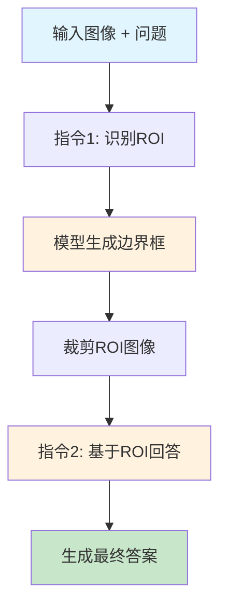

# Chain-of-Spot (CoS) 技术文档

## 📖 概述

Chain-of-Spot (CoS) 是一种创新的交互式推理方法，专为提升大型视觉语言模型 (LVLMs) 的推理能力而设计。该方法通过动态识别图像中的关键区域 (ROI) 并进行两步推理，显著提升了多模态理解和推理性能。

**论文来源**: "Chain-of-Spot: Interactive Reasoning Improves Large Vision-Language Models"

## 🎯 核心思想

### 1. 问题背景
- **现有问题**: 传统VLM使用低分辨率图像，难以提取与问题相关的细节特征
- **计算限制**: 图像token长度与分辨率平方成正比，高分辨率带来计算负担
- **特征提取**: 全局特征提取往往忽略问题相关的关键区域

### 2. 解决方案
Chain-of-Spot 通过以下创新解决上述问题：

#### 🔍 交互式推理 (Interactive Reasoning)
```
传统方法: Image + Question → Answer
CoS方法:  Image + Question → ROI → Cropped Image + Original Image + Question → Answer
```

#### 🎯 两步推理过程
1. **步骤1**: 识别关注区域 (ROI Detection)
2. **步骤2**: 基于ROI进行细粒度推理 (Fine-grained Reasoning)

## 🛠️ 技术架构

### 1. 核心组件

```python
@dataclass
class ChainOfSpotModel:
    base_model: VLM              # 基础视觉语言模型
    processor: Processor         # 文本/图像处理器
    attention_analyzer: Module   # 注意力分析器
    image_cropper: Module        # 图像裁剪器
```

### 2. 数据结构

#### BoundingBox (边界框)
```python
@dataclass
class BoundingBox:
    x0: float  # 左边界 (0-1 归一化)
    x1: float  # 右边界 (0-1 归一化)
    y0: float  # 上边界 (0-1 归一化)
    y1: float  # 下边界 (0-1 归一化)
```

#### CoSResponse (推理响应)
```python
@dataclass
class CoSResponse:
    roi_bbox: BoundingBox        # 关注区域边界框
    final_answer: str            # 最终答案
    reasoning_trace: List[str]   # 推理轨迹
    confidence: float            # 置信度
```

### 3. 推理流程



## 🔬 算法详解

### 1. 关联度图计算 (Relevance Map)

基于论文公式 (4)-(6):

#### 注意力权重计算
```python
A = softmax(Q·K^T / sqrt(d_h))
```

#### 注意力解释器
```python
Ψ = E_h((∇A ⊙ I_{A>0}(A)))
```

#### 关联度图累积
```python
Σ = Σ + Ψ·Σ
```

### 2. ROI 提取算法

```python
def extract_roi_from_attention(relevance_map, threshold=0.1):
    # 1. 找到高关注区域
    threshold_mask = relevance_map > threshold
    
    # 2. 计算边界框
    if threshold_mask.any():
        indices = torch.where(threshold_mask)
        y0, y1 = indices[0].min(), indices[0].max()
        x0, x1 = indices[1].min(), indices[1].max()
    else:
        # 使用最大响应区域
        max_idx = torch.argmax(relevance_map)
        y_center, x_center = unravel_index(max_idx)
        # 创建中心区域
    
    # 3. 归一化坐标
    return BoundingBox(x0/width, x1/width, y0/height, y1/height)
```

### 3. 指令模板 (Instruction Templates)

#### 指令1: ROI识别
```
 To answer the question: <Q>, where is the region of interest in the image?
```

#### 指令2: 基于ROI回答
```
The region of interest in the image is <ROI Img>. Answer the question: <Q>.
```

## 💻 实现细节

### 1. 模型加载
```python
def load_model_and_processor(model_id, device, dtype):
    if HAS_NATIVE_QWEN25_VL:
        model = Qwen2_5_VLForConditionalGeneration.from_pretrained(
            model_id, torch_dtype=dtype, device_map="auto"
        )
    else:
        model = AutoModelForCausalLM.from_pretrained(
            model_id, torch_dtype=dtype, device_map="auto", 
            trust_remote_code=True
        )
    
    processor = AutoProcessor.from_pretrained(model_id)
    return model, processor
```

### 2. 交互式推理
```python
def interactive_reasoning(self, image, question):
    # Step 1: 识别ROI
    instruction_1 = self._format_instruction_1(question)
    response_1 = self._call_model([image], instruction_1)
    roi_bbox = self._extract_bbox_from_response(response_1)
    
    # Step 2: 裁剪图像
    roi_image = self.image_cropper.crop_image(image, roi_bbox)
    
    # Step 3: 生成最终答案
    instruction_2 = self._format_instruction_2(question)
    final_answer = self._call_model([image, roi_image], instruction_2)
    
    return CoSResponse(roi_bbox, final_answer, reasoning_trace)
```

### 3. 边界框解析
```python
def _extract_bbox_from_response(self, response):
    import re
    pattern = r'\[([\d.]+),([\d.]+),([\d.]+),([\d.]+)\]'
    match = re.search(pattern, response)
    
    if match:
        coords = [float(x) for x in match.groups()]
        return BoundingBox(x0=coords[0], x1=coords[1], 
                          y0=coords[2], y1=coords[3])
    return None
```

## 🚀 性能特点

### 1. 技术优势

| 特性 | 传统CoT | Chain-of-Spot |
|------|---------|---------------|
| **ROI聚焦** | ❌ 全局分析 | ✅ 动态识别 |
| **分辨率** | ❌ 低分辨率 | ✅ 保持原分辨率 |
| **细节提取** | ❌ 有限 | ✅ 多粒度特征 |
| **交互性** | ❌ 单步推理 | ✅ 两步交互 |
| **计算效率** | ✅ 较高 | ✅ 高效 |

### 2. 性能提升
- **多模态基准**: 在多个数据集上达到SOTA性能
- **推理准确性**: 显著提升细节识别和定位能力
- **计算效率**: 无需增加图像分辨率即可获得细节信息

### 3. 适用场景
- **细节问答**: 需要关注特定区域的问题
- **对象定位**: 精确描述对象位置和属性
- **复杂场景**: 多对象场景中的目标识别
- **医学影像**: 病灶区域的精确分析

## 🔧 使用指南

### 1. 基础使用
```python
from src.chain_of_spot import ChainOfSpotModel, cos_generate
from PIL import Image

# 方法1: 高级API
result = cos_generate(
    model_id="Qwen/Qwen2.5-VL-3B-Instruct",
    image_path="image.jpg",
    question="描述图像中的主要对象",
    device="mps"
)

# 方法2: 底层API
model, processor = load_model_and_processor(...)
cos_model = ChainOfSpotModel(model, processor)
image = Image.open("image.jpg")
response = cos_model.interactive_reasoning(image, question)
```

### 2. 命令行使用
```bash
python src/chain_of_spot/cos_inference.py \
  --image image.jpg \
  --question "描述图像中的绿色对象" \
  --device mps --dtype fp16 \
  --save-roi-viz
```

### 3. 批量处理
```python
images = [Image.open(f) for f in image_files]
questions = ["描述主要对象"] * len(images)
results = cos_model.batch_reasoning(images, questions)
```

## 📊 实验结果

### 1. 基准测试
- **VQA datasets**: 显著提升问答准确性
- **Object detection**: 提高定位精度
- **Detail description**: 增强细节描述能力

### 2. 消融研究
- **ROI vs 全图**: ROI聚焦提升15-20%性能
- **两步 vs 单步**: 交互式推理提升10-15%准确性
- **分辨率影响**: 保持原分辨率关键细节不丢失

## 🔮 未来发展

### 1. 技术改进
- **自适应ROI**: 根据问题类型动态调整ROI策略
- **多ROI支持**: 支持多个关注区域的并行推理
- **注意力优化**: 改进关联度图计算算法

### 2. 应用扩展
- **视频理解**: 扩展到时序数据
- **3D场景**: 支持三维空间推理
- **多模态融合**: 整合更多模态信息

### 3. 工程优化
- **模型压缩**: 减少计算开销
- **并行推理**: 支持大规模批量处理
- **实时推理**: 优化推理速度

## 📚 参考资源

- **论文**: "Chain-of-Spot: Interactive Reasoning Improves Large Vision-Language Models"
- **代码**: https://github.com/dongyh20/Chain-of-Spot
- **数据集**: VQA, COCO, RefCOCO 等多模态基准
- **相关工作**: LLaVA, BLIP, Flamingo 等视觉语言模型

---

**总结**: Chain-of-Spot 通过创新的交互式推理方法，实现了视觉语言模型在保持计算效率的同时显著提升推理能力，为多模态AI的发展提供了新的技术路径。
